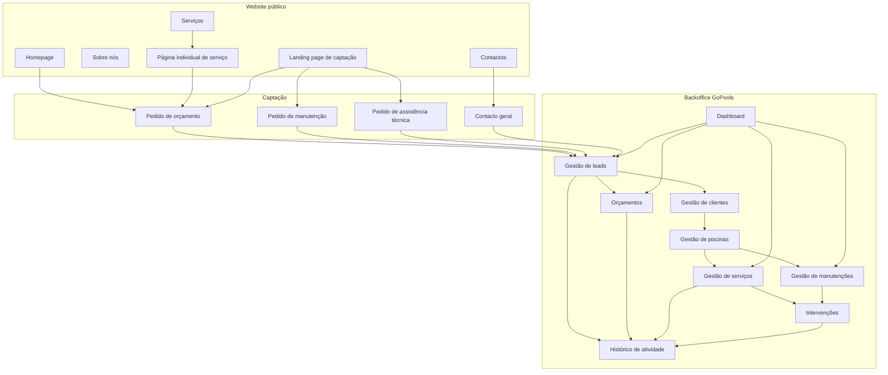
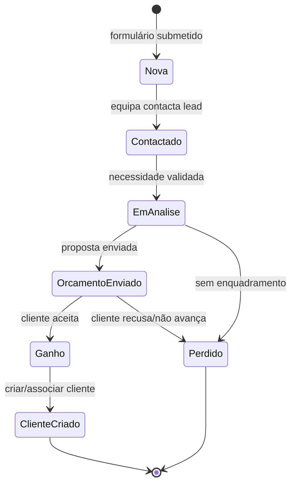
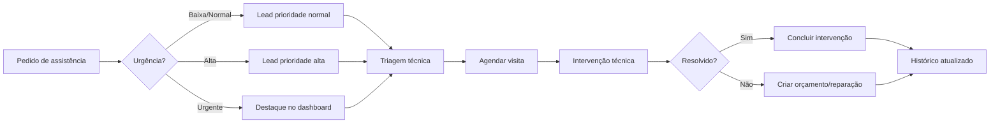
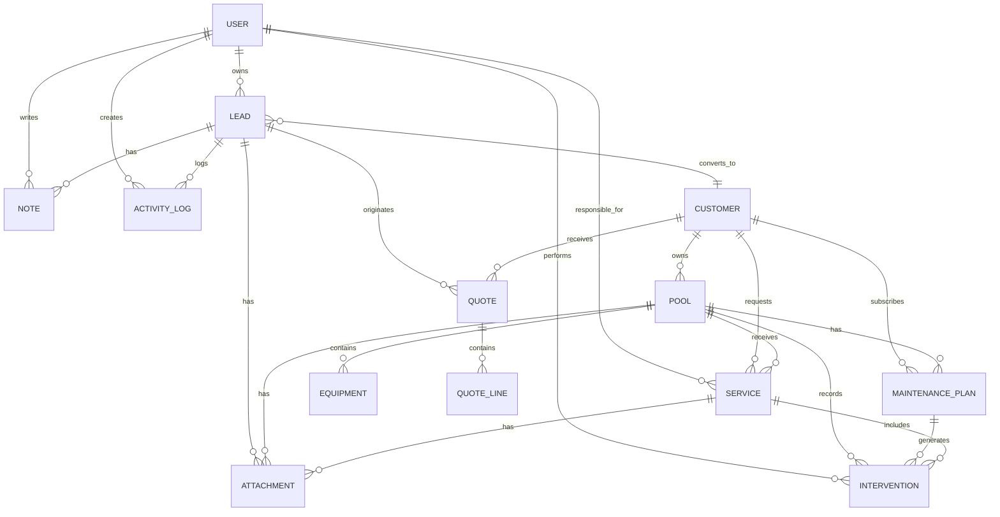

# GoPools — Visualização da Arquitetura e Wireframes

Este documento permite visualizar a proposta sem implementar código de aplicação. Os diagramas usam Mermaid, suportado nativamente pelo GitHub e por extensões comuns de preview Markdown no VS Code.

## 1. Mapa visual da plataforma



## 2. Fluxo comercial visual



## 3. Fluxo de assistência técnica



## 4. ERD conceptual simplificado



## 5. Wireframe visual textual — Homepage

```txt
┌─────────────────────────────────────────────────────────────────────┐
│ LOGO GoPools      Início  Sobre  Serviços  Orçamento  Contactos     │
├─────────────────────────────────────────────────────────────────────┤
│                                                                     │
│  Piscinas técnicas, eficientes e preparadas para o Algarve           │
│  Construção, remodelação, manutenção e assistência técnica.          │
│                                                                     │
│  [Pedir orçamento]   [Ver serviços]        [Imagem/hero piscina]     │
│                                                                     │
├─────────────────────────────────────────────────────────────────────┤
│  Serviços principais                                                │
│  ┌────────────┐ ┌────────────┐ ┌────────────┐                       │
│  │Construção  │ │Remodelação │ │Manutenção  │                       │
│  └────────────┘ └────────────┘ └────────────┘                       │
│  ┌────────────┐ ┌────────────┐ ┌────────────┐                       │
│  │Assistência │ │Trat. água  │ │Equipamentos│                       │
│  └────────────┘ └────────────┘ └────────────┘                       │
├─────────────────────────────────────────────────────────────────────┤
│  Porquê GoPools                                                     │
│  Qualidade técnica | Resposta organizada | Experiência Algarve       │
├─────────────────────────────────────────────────────────────────────┤
│  Formulário rápido                                                  │
│  Nome | Telefone | Email | Localidade | Serviço | Mensagem           │
│  [Enviar pedido]                                                    │
└─────────────────────────────────────────────────────────────────────┘
```

## 6. Wireframe visual textual — Dashboard

```txt
┌───────────────┬─────────────────────────────────────────────────────┐
│ GoPools Admin │ Topo: Utilizador | Pesquisa futura | Notificações    │
├───────────────┼─────────────────────────────────────────────────────┤
│ Dashboard     │ ┌────────────┐ ┌────────────┐ ┌────────────┐       │
│ Leads         │ │Leads novas │ │Em aberto   │ │Clientes    │       │
│ Clientes      │ └────────────┘ └────────────┘ └────────────┘       │
│ Piscinas      │ ┌────────────┐ ┌────────────┐ ┌────────────┐       │
│ Serviços      │ │Agendados   │ │Urgentes    │ │Mês atual   │       │
│ Manutenções   │ └────────────┘ └────────────┘ └────────────┘       │
│ Intervenções  │                                                     │
│ Orçamentos    │ Últimas leads | Próximas visitas | Orçamentos pend. │
└───────────────┴─────────────────────────────────────────────────────┘
```

## 7. Wireframe visual textual — Detalhe de lead

```txt
┌─────────────────────────────────────────────────────────────────────┐
│ Lead: Maria Silva                         Estado: Nova | Prioridade │
├─────────────────────────────────────────────────────────────────────┤
│ Dados principais                                                     │
│ Nome | Telefone | Email | Localidade | Origem | Tipo de serviço      │
├─────────────────────────────────────────────────────────────────────┤
│ Mensagem inicial                                                     │
│ "Pretendo remodelar piscina e instalar bomba de calor..."           │
├───────────────────────┬─────────────────────────────────────────────┤
│ Ações                 │ Histórico                                   │
│ [Contactar]           │ - Lead criada via landing page               │
│ [Alterar estado]      │ - Responsável atribuído                      │
│ [Criar orçamento]     │ - Nota adicionada                            │
│ [Converter cliente]   │                                             │
├───────────────────────┴─────────────────────────────────────────────┤
│ Notas | Anexos | Orçamentos associados                              │
└─────────────────────────────────────────────────────────────────────┘
```
